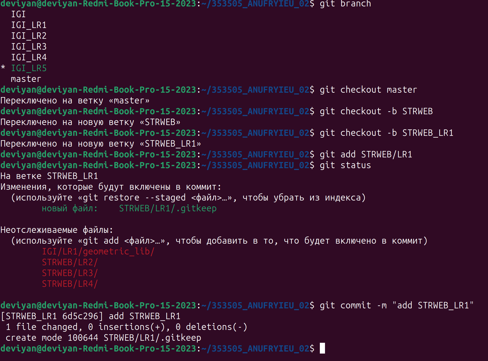
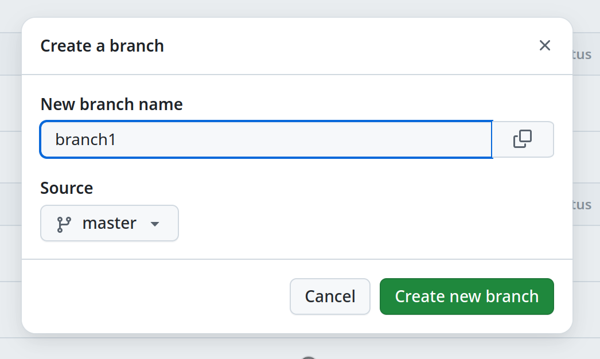

# ОТЧЕТ ПО ВЫПОЛНЕНИЮ ЛАБОРАТОРНОЙ РАБОТЫ №1 (ИГИ)
### Ануфриев Денис Игоревич, гр. 353505

Данный readme-файл содержит отчет по выполнению лабораторной работы №1 ИГИ по работе с git

## 1. Создайте структуру папок (использовать командную строку) и поместите в репозиторий Git на своем локальном компьютере
## 2. Создайте репозиторий внутри папки LR1 с помощью клонирования проекта с сайта github.com (https://github.com/smartiqaorg/geometric_lib):

Решение пунктов 1 и 2 (+ выполнение индивидуального задания)

## a. В локальном репозитории до и после выполнения операции: сделайте индексацию нескольких файлов в вашем Git-репозитории (git add …)     
## b. внесите изменения в файлы

Внесение изменений в текстовые файлы проекта

## c. выполните коммиты к проиндексированным  файлам,

Первый коммит

## d. добавьте и удалите файлы (один и группу файлов с определенным расширением)

Добавление и удаление файлов через консоль

## e. переименуйте файлы

Переименование файлов

## f. создайте для IGI и STRWEB, а также для каждой ЛР, вложенной в них, отдельные ветки, переместите папки и файлы на соответствующие ветки

Создание пустых файлов .gitkeep

Создание ветки IGI и IGI_LR1 (требование подключения подмодуля)

подключения подмодуля в ветке IGI_LR1

Коммит ветки IGI_LR1

Создание и коммит ветки IGI_LR2

Создание и коммит ветки IGI_LR3

Создание и коммит ветки IGI_LR4

Создание и коммит ветки IGI_LR5

Создание и коммиты веток STRWEB & STRWEB_LR1

Создание и коммит ветки STRWEB_LR2

Ветки STRWEB_LR3 и STRWEB_LR4 создаются точно таким же образом, как и ветка STRWEB_LR2

Результат создания веток

## g. выведите историю коммитов: полностью и с ограничением вывода – отобрать только последние,  до и после указанной даты, по автору файлов, коммитов (флаги n, since, after, until, before, author, committer, grep) https://code.mu/ru/tool/git/basis/limit-output-commit-history-flags/ ,

git log --all

git log & git log -n

git log --since, --after, --until, --before

git log --author, --committer

git log --since, --grep

## h. исследуйте флаги для git log: p , stat ,shortstat, name-only, name-status, relative-date, pretty, graph,

git log -p

git log --stat

git log --name-only, --name-status, --relative-date, --before

git log --pretty

git log --graph

git log --graph (продолжение)

## i. найдите разницу в изменениях для каждого коммита

Просмотр разницы в изменениях в каждом из коммитов

## j. создайте новый файл test.txt и вставьте в него строчку 'номер варианта'. затем сделайте коммит и отмените его

Создание файла со строкой, коммит и откат от коммита

## k. проиндексируйте файл в вашем Git-репозитории, затем отмените его индексацию

Индексация файла и его отмена

## l. внесите изменения в файл в вашем Git-репозитории и затем верните его в исходное состояние.

Внесения изменений в файл test.txt и затем его возврат в исходное состояние

# Действия с удаленным репозиторием:
## a. создайте удаленный репозиторий (на github.com)

Создание удаленного репозитория

## b. просмотрите информацию о нем, внесите изменения и опять просмотрите (remote, fetch).

Подключение удаленного репозитория к локальному и просмотр информации

Подключение локальной ветки master к удаленному репозиторию

Уведомление на GitHub о добавлении ветки master

Пушим все ветки локального репозитория

## c. измените несколько файлов в вашем проекте и перенесите их в удаленный репозиторий, 

Перенос файла test.txt в удаленный репозиторий

Проверка переноса на GitHub

## d. переименуйте свой удаленный репозиторий

Переименование удаленного репозитория

## e. получите данные из удаленного репозитория

git fetch

## f. просмотреть историю изменений

История коммитов с удаленным репозиторием

## g. создайте дополнительную ветку 1 в удаленном реппозитории, перенесите в нее два файла из другой ветки, удалите один из файлов

Кнопка создания ветки на удаленном репозитории GitHub

Создание удаленной ветки branch1

Получение удаленной ветки branch1 в локальный репозиторий и копирование в нее двух файлов из проекта

Удаление одного из перенесенных ранее файлов

Коммит внесенных изменений и пуш в удаленную ветку

## h. создайте дополнительную ветку 2 в удаленном реппозитории, перенесите в нее два файла из вашего проекта, слить изменения в основную ветку, удалить дополнительную ветку 2

Создание удаленной ветки branch2

Копирование в нее двух файлов из проекта, коммит изменений, слияние ветки branch2 в master и удаление ветки branch2

Пуш всех новых коммитов и слияний в удаленный репозиторий GitHub

